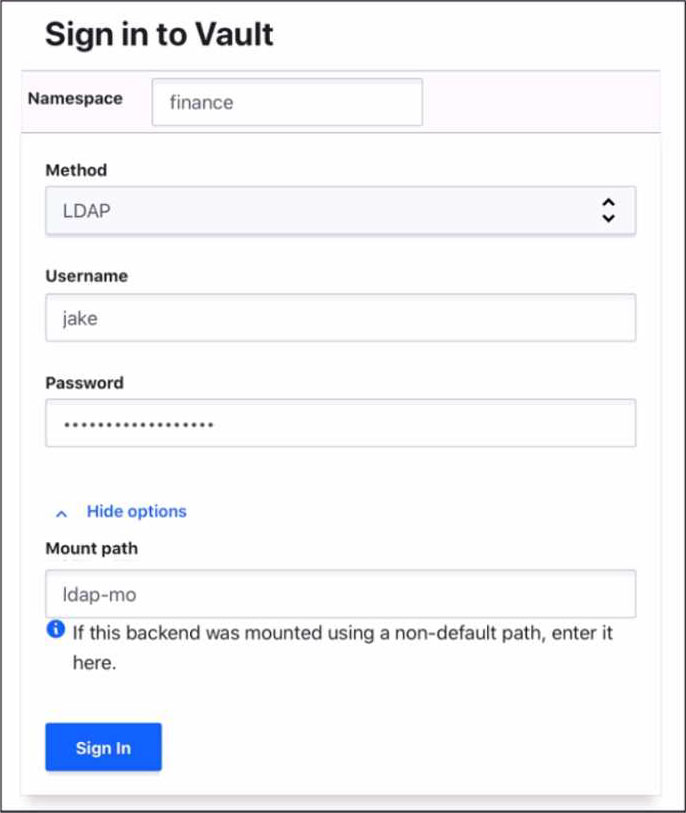

# Vault Associate 002
---
> #### Q1: You are using the Vault userpass auth method mounted at auth/userpass.How do you create a new user named "sally" with password "h0wN0wB4r0wnC0w"? This new user will need the power-users policy.
- [ ] `vault put auth/userpass/users/sally password=h0wN0wB4r0wnC0w policies=power-users`
- [ ] `vault write userpass/sally password=h0wN0wB4r0wnC0w policies=power-users`
- [ ] `vault kv write userpass/sally password=h0wN0wB4r0wnC0w policies=power-users`
- [ ] `vault write auth/userpass/users/sally password=h0wN0wB4r0wnC0w policies=power-users`

  
 Answer 

  
  `vault put auth/userpass/users/sally password=h0wN0wB4r0wnC0w policies=power-users`
  

> #### Q2: The Vault lease renew command increments the lease time from:
- [ ] The current time
- [ ] The end of the lease

  
 Answer 

  
  The Current Time, not the end of the lease. This means that the user can request a specific amount of time they want remaining on the lease, termed the increment. This is not an increment at the end of the current TTL; it is an increment from the current time. For example, `vault lease renew -increment=3600 my-lease-id` would request that the TTL of the lease be adjusted to 1 hour(3600 seconds) from now. Having the increment be rooted at the current time instead of the end of the lease makes it easy for users to reduce the length of leases if they don't actually need credentials for the full possible lease period, allowing those credentials to expire sooner and resources to be cleaned up earlier. The requested increment is completely advisory. The backend in charge of the secret can choose to completely ignore it.
  Refrence: Lease, Renew, and Revoke | Vault | HashiCorp Developer
  

> #### Q3: HOTSPOT Where do you define the Namespace to log into using the Vault UI?

- [ ] `vault put auth/userpass/users/sally password=h0wN0wB4r0wnC0w policies=power-users`
- [ ] `vault write userpass/sally password=h0wN0wB4r0wnC0w policies=power-users`
- [ ] `vault kv write userpass/sally password=h0wN0wB4r0wnC0w policies=power-users`
- [ ] `vault write auth/userpass/users/sally password=h0wN0wB4r0wnC0w policies=power-users`

  
 Answer 

  
  `vault put auth/userpass/users/sally password=h0wN0wB4r0wnC0w policies=power-users`
  

