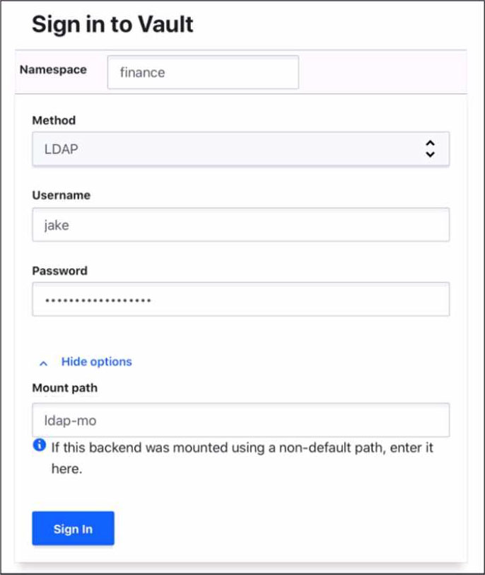
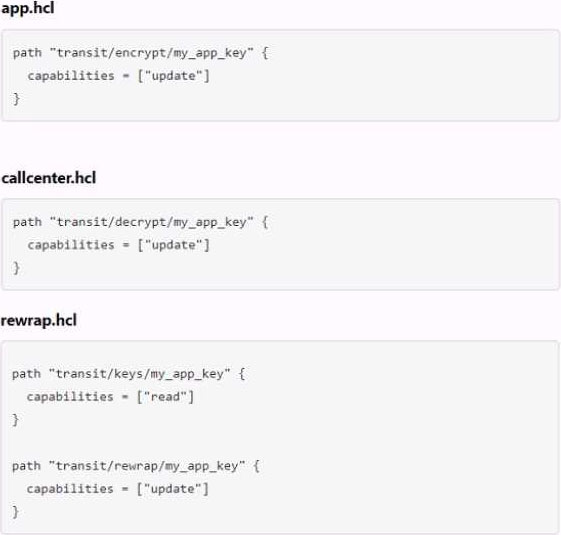
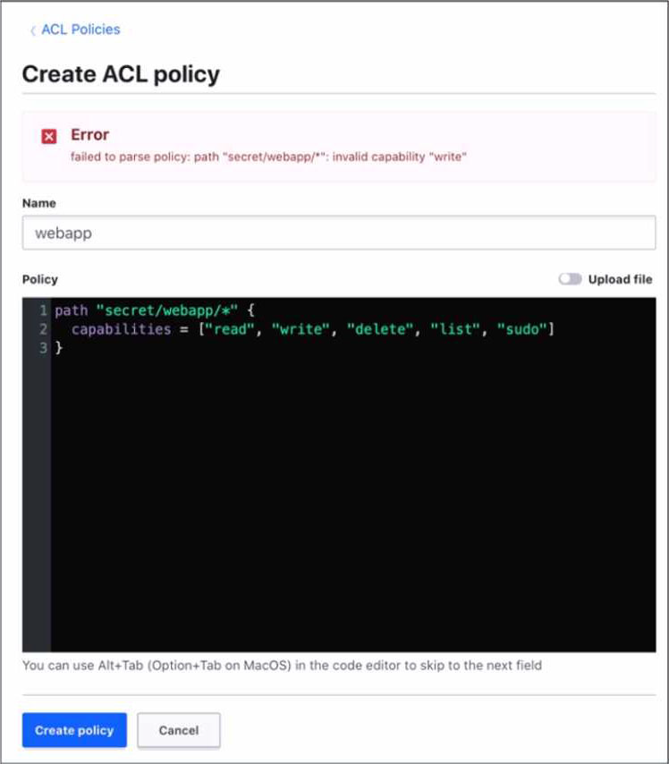
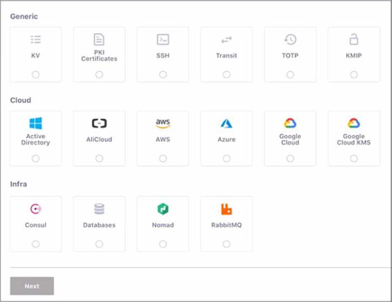
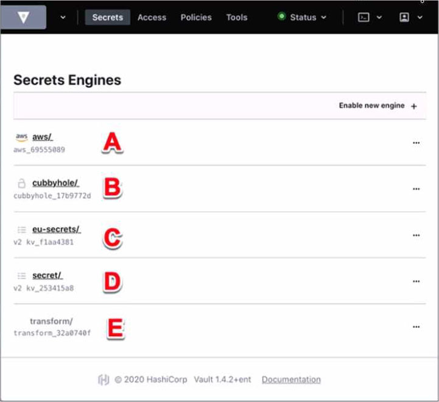
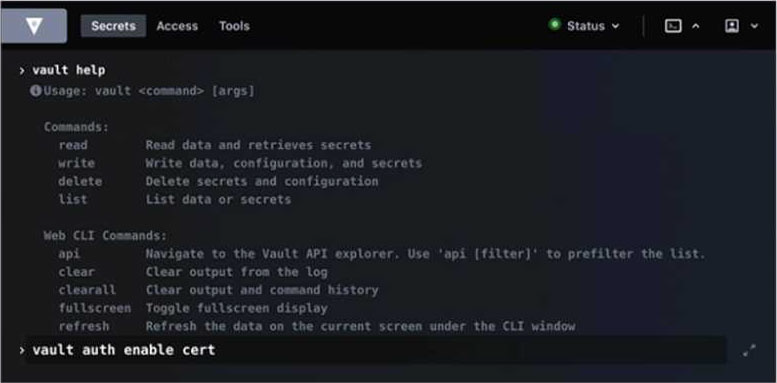
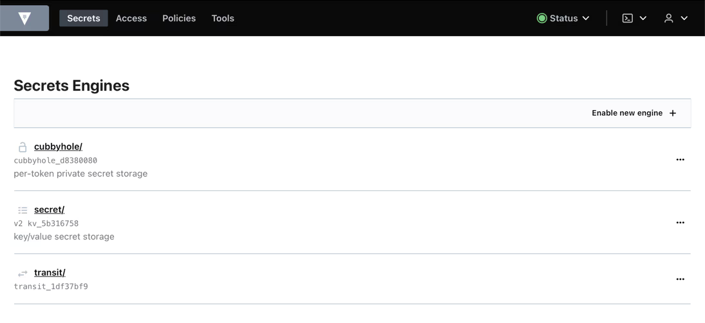
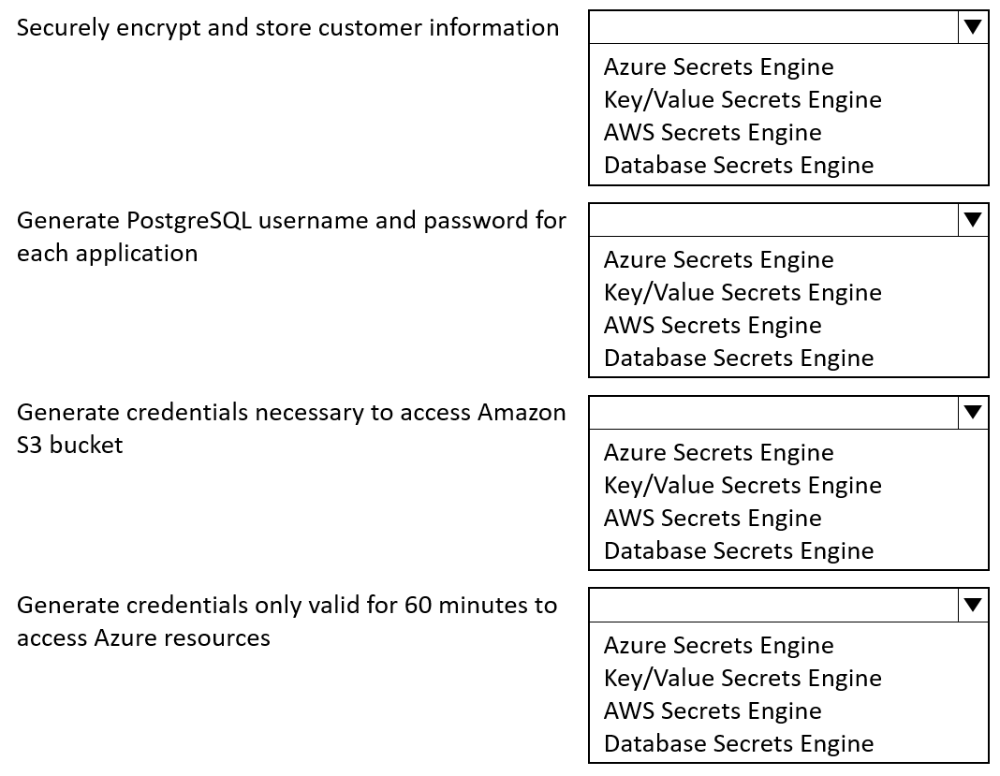
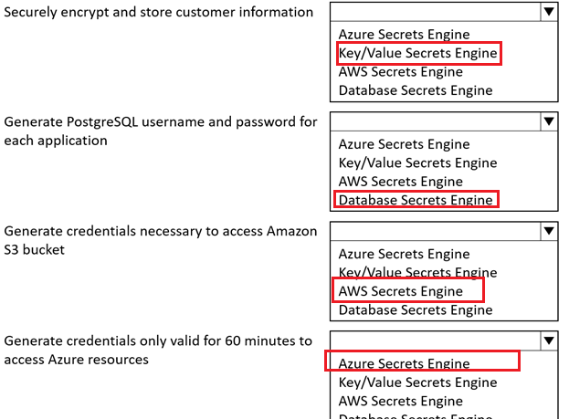

# Vault Associate 002
---
> #### Q1: You are using the Vault userpass auth method mounted at auth/userpass.How do you create a new user named "sally" with password "h0wN0wB4r0wnC0w"? This new user will need the power-users policy.
- [ ] `vault put auth/userpass/users/sally password=h0wN0wB4r0wnC0w policies=power-users`
- [ ] `vault write userpass/sally password=h0wN0wB4r0wnC0w policies=power-users`
- [ ] `vault kv write userpass/sally password=h0wN0wB4r0wnC0w policies=power-users`
- [ ] `vault write auth/userpass/users/sally password=h0wN0wB4r0wnC0w policies=power-users`
<details>
  <summary> Answer </summary>
  
  `vault write auth/userpass/users/sally password=h0wN0wB4r0wnC0w policies=power-users`
  
</details>

> #### Q2: The Vault lease renew command increments the lease time from:
- [ ] The current time
- [ ] The end of the lease
<details>
  <summary> Answer </summary>
  
  The Current Time, not the end of the lease. This means that the user can request a specific amount of time they want remaining on the lease, termed the increment. This is not an increment at the end of the current TTL; it is an increment from the current time. For example, `vault lease renew -increment=3600 my-lease-id` would request that the TTL of the lease be adjusted to 1 hour(3600 seconds) from now. Having the increment be rooted at the current time instead of the end of the lease makes it easy for users to reduce the length of leases if they don't actually need credentials for the full possible lease period, allowing those credentials to expire sooner and resources to be cleaned up earlier. The requested increment is completely advisory. The backend in charge of the secret can choose to completely ignore it.
  Refrence: Lease, Renew, and Revoke | Vault | HashiCorp Developer
  
</details>

> #### Q3: HOTSPOT Where do you define the Namespace to log into using the Vault UI?


<details>
  <summary> Answer </summary>
  
  Namespace 

</details>

> #### Q4: You have a 2GB Base64 binary large object (blob) that needs to be encrypted. Which of the following best describes the transit secrets engine?
- [ ] A Data key encrypts the blob locally, and the same key decrypts the blob locally.
- [ ] To process such a large blob. Vault will temporarily store it in the storage backend.
- [ ] Vault will store the blob permanently. Be sure to run Vault on a compute optimized machine
- [ ] The transit engine is not a good solution for binaries of this size.
<details>
  <summary> Answer </summary>
  
  The transit engine is not a good solution for binaries of this size, because it is designed to handle cryptographic functions on data in-transit, not data at-rest. The transit secrets engine does not store any data sent to it, so it would require sending the entire 2GB blob to Vault for encryption or decryption,
  which would be inefficient and impractical. A better solution would be to use the transit secrets engine to generate a data key, which is a high-entropy key that can be used to encrypt or decrypt data locally. The data key can be returned in plaintext or wrapped by another key, depending on the use case. This way, the transit secrets engine only handles the encryption or decryption of the data key, not the data itself, and the data can be stored in any primary data store.

  Reference: Transit - Secrets Engines | Vault | HashiCorp Developer, Encryption as a service: transit secrets engine | Vault | HashiCorp Developer
</details>

> #### Q5: How would you describe the value of using the Vault Transit secrets engine?
- [ ] Vault has an API that can be programmatically consumed by applications
- [ ] The transit secrets engine ensures encryption in-transit and at-rest is enforced enterprise wide
- [ ] Encryption for application data is best handled by a storage system or database engine, while storing encryption keys in Vault
- [ ] The transit secrets engine relieves the burden of proper encryption/decryption from application developers and pushes the burden onto the operators of Vault
<details>
  <summary> Answer </summary>
  
  The transit secrets engine relieves the burden of proper encryption/decryption from application developers and pushes the burden onto the operators of Vault. The transit secrets engine provides encryption as a service, which means that it performs cryptographic operations on data in-transit without storing any data. This allows developers to delegate the responsibility of managing encryption keys and algorithms to Vault operators, who can define and enforce policies on the transit secrets engine. This way, developers can focus on their application logic and data, while Vault handles the encryption and decryption of data in a secure and scalable manner.

  Reference: Transit - Secrets Engines | Vault | HashiCorp Developer, Encryption as a service: transit
  secrets engine | Vault | HashiCorp Developer
</details>

> #### Q6: What is the Vault CLI command to query information about the token the client is currently using?

- [ ] `vault lookup token`
- [ ] `vault token lookup`
- [ ] `vault lookup self`
- [ ] `vault self-lookup`
<details>
  <summary> Answer </summary>
  
  `vault token lookup` The Vault CLI command to query information about the token the client is currently using is vault token lookup. This command displays information about the token or accessor provided as an argument, or the locally authenticated token if no argument is given. The information includes the token ID, accessor, policies, TTL, creation time, and metadata. This command can be useful for debugging and auditing purposes, as well as for renewing or revoking tokens.

Reference: token lookup - Command | Vault | HashiCorp Developer, Tokens | Vault | HashiCorp Developer
</details>

> #### Q7: Which of the following is a machine-oriented Vault authentication backend?

- [ ] Okta
- [ ] AppRole
- [ ] Transit
- [ ] GitHub
<details>
  <summary> Answer </summary>
  
  AppRole is a machine-oriented authentication method that allows machines or applications to authenticate with Vault using a role ID and a secret ID. The role ID is a unique identifier for the application, and the secret ID is a single-use credential that can be delivered to the application securely. AppRole is designed to provide secure introduction of machines and applications to Vault, and to support the principle of least privilege by allowing fine-grained access control policies to be attached to each role. Okta, GitHub, and Transit are not machine-oriented authentication methods. Okta and GitHub are useroriented authentication methods that allow users to authenticate with Vault using their Okta or GitHub credentials. Transit is not an authentication method at all, but a secrets engine that provides encryption as a service.

Reference: AppRole Auth Method | Vault | HashiCorp Developer Okta Auth Method | Vault | HashiCorp Developer GitHub Auth Method | Vault | HashiCorp Developer Transit Secrets Engine | Vault | HashiCorp Developer
</details>

> #### Q8: Security requirments demand that no secrets appear in the shell history. Which command does not meet this requirment?

- [ ] `generate-password | vault kv put secret/password value`
- [ ] `vault kv put secret/password value-itsasecret`
- [ ] `vault kv put secret/password value=@data.txt`
- [ ] `vault kv put secret/password value-SSECRET_VALUE`
<details>
  <summary> Answer </summary>
 
  `vault kv put secret/password value-itsasecret`
   This command would store the secret value `itsasecret` in the `key/value` secrets engine at the path `secret/password`, but it would also expose the secret value in the shell history, which could be accessed by other users or malicious actors. This is not a secure way of storing secrets in Vault. The other commands are more secure ways of storing secrets in Vault without revealing them in the shell history.


</details>

> #### Q9: You can build a high availability Vault cluster with any storage backend.

- [ ] True
- [ ] False
<details>
  <summary> Answer </summary>
 
  False
   Not all storage backends support high availability mode for Vault. Only the storage backends that support locking can enable Vault to run in a multi-server mode where one server is active and the others are standby. Some examples of storage backends that support high availability mode are Consul, Integrated Storage, and ZooKeeper. Some examples of storage backends that do not support high availability mode are Filesystem, MySQL, and PostgreSQL.
  
  Reference:
  https://developer.hashicorp.com/vault/docs/concepts/ha1,
  https://developer.hashicorp.com/vault/docs/configuration/storage2
   
</details>

> #### Q10: What command creates a secret with the `my-password` and the value `53cr3t` at path `my-secrets` within `KV` secrets engine mounted at `secret`

- [ ] `vault kv put secret/my-secrets/my-password 53cr3t`
- [ ] `vault kv write secret/my-secrets/my-password 53cr3t`
- [ ] `vault kv write 53cr3t my-secrets/my-password`
- [ ] `vault kv put secret/my-secrets »y-password-53cr3t`
<details>
  <summary> Answer </summary>
  
  `vault kv put secret/my-secrets/my-password 53cr3t`
   or `vault kv put secret/my-secrets my-password=53cr3t`

   Reference: https://developer.hashicorp.com/vault/docs/commands/kv/put3,
              https://developer.hashicorp.com/vault/docs/commands/kv4
</details>

> #### Q11: What can be used to limit the scope of a credential breach?
- [ ] Storage of secrets in a distributed ledger
- [ ] Enable audit logging 
- [ ] Use of a short-lived dynamic secrets
- [ ] Sharing credentials between applications
<details>
  <summary> Answer </summary>
  
  Use of a short-lived dynamic secrets Dynamic secrets are generated on-demand by Vault and automatically revoked when they are no longer needed. This way, the credentials are not stored in plain text or in a static database, and they can be rotated frequently to prevent unauthorized access. Dynamic secrets also provide encryption as a service, which means that they perform cryptographic operations on data in transit without storing any data. This adds an extra layer of security and reduces the risk of data leakage or tampering.

  Reference: Dynamic secrets | Vault | HashiCorp Developer, What are dynamic secrets and why do I need them? - HashiCorp
</details>

> #### Q12: What environment variable overrides the CLI's default Vault server address?

- [ ] `VAULT_ADDR`
- [ ] `VAULT_HTTP_ADORESS`
- [ ] `VAULT_ADDRESS`
- [ ] `VAULT_HTTPS_ADDRESS`
<details>
  <summary> Answer </summary>
  
  `VAULT_ADDR`
  This environment variable can be set to the URL of the Vault server, which is used by Vault's CLI tool to communicate with the Vault server.
</details>

> #### Q13: Which of the following statements describe the CLI command below?
`vault login -method-ldap username-mitche11h`
- [ ] Generates a token which is respone wrapped
- [ ] You will be prompted to enter the password
- [ ] By default the gernerated token is valid for 24 hours
- [ ] Fails because the password is not provided
<details>
  <summary> Answer </summary>
  
  This command is a command to log in to Vault using the LDAP method. Usually, after executing this command, the user is prompted to enter their password, rather than the command immediately failing because the password was not provided. `vault login -method=ldap username=mitchellh`
</details>

> #### Q14: The following three policies exist in Vault. What do these policies allow an oraginization to do?

- [ ] Separates permissions allowed on actions associated with the transit secret engine
- [ ] Nothing, as the minimum permissions to perform useful tasks are not present
- [ ] Encrypt, decrypt, and rewrap data using the transit engine all in one policy
- [ ] Create a transit encryption key for encrypting, decrypting, and rewrapping encrypted data
<details>
  <summary> Answer </summary>
  Separates permissions allowed on actions associated with the transit secret engine
  These policies allow organizations to:
  Separates permissions allowed on actions associated with the transit secret engine Here's how to do it: app.hcl The policy allows the entity to perform cryptographic operations using a specific key () of the Transit secret engine my_app_key callcenter.hcl The policy allows decryption operations to be performed on the same my_app_key rewrap.hcl Policies allow the key to be read and the data to be reencapsulated, which essentially decrypts and re-encrypts the data without displaying plaintext, which is useful for rotating the underlying encryption key. Each policy targets specific operations of the Transit secret engine, enabling fine-grained access control to encryption,decryption, and key management functions. This is important for maintaining a strict separation of duties within the organization.

</details>

> #### Q15: Your DevOps team would like to provision VMs in GCP via CICD pipeline. They would like to integrate Vault to protect the credentials used by the tool. Which secrets engine would you recommend?

- [ ] Google Cloud Secrets Engine
- [ ] Identity secrets engine
- [ ] Key/Value secrets engine version 2
- [ ] SSH secrets engine
<details>
  <summary> Answer </summary>
 
  The Google Cloud Secrets Engine is the best option for the DevOps team to provision VMs in GCP via a CICD pipeline and integrate Vault to protect the credentials used by the tool. The Google Cloud Secrets Engine can dynamically generate GCP service account keys or OAuth tokens based on IAM policies, which can be used to authenticate and authorize the CICD tool to access GCP resources. The credentials are automatically revoked when they are no longer used or when the lease expires, ensuring that the credentials are short-lived and secure. The DevOps team can configure rolesets or static accounts in Vault to define the scope and permissions of the credentials, and use the Vault API or CLI to request credentials on demand. The Google Cloud Secrets Engine also supports generating access tokens for impersonated service accounts, which can be useful for delegating access to other serviceaccounts without storing or managing their keys. The Identity Secrets Engine is not a good option for this use case, because it does not generate GCP credentials, but rather generates identity tokens that can be used to access other Vault secrets engines or namespaces. The Key/Value Secrets Engine version 2 is also not a good option, because it does not
  generate dynamic credentials, but rather stores and manages static secrets that the user provides. The SSH Secrets Engine is not a good option either, because it does not generate GCP credentials, but rather generates SSH keys or OTPs that can be used to access remote hosts via SSH.

  Reference: Google Cloud - Secrets Engines | Vault | HashiCorp Developer Identity - Secrets Engines | Vault | HashiCorp Developer KV - Secrets Engines | Vault
</details>

> #### Q16: Which of these is not a benefit of dynamic secrets?

- [ ] Supports systems which do not natively provide a method of expiring credentials
- [ ] Minimizes damage of credentials leaking
- [ ] Ensures that administrators can see every password used
- [ ] Replaces cumbersome password rotation tools and practices
<details>
  <summary> Answer </summary>

Ensures that administrators can see every password use. Dynamic secrets are generated on-demand by Vault and have a limited time-to-live (TTL). THEY DO NOT
ensure that administrators can see every password used, as they are often encrypted and ephemeral. 
The benefits of dynamic secrets are:
- They support systems that do not natively provide a method of expiring credentials, such as databases,
cloud providers, SSH, etc. 
- Vault can revoke the credentials when they are no longer needed or when the lease expires.
- They minimize the damage of credentials leaking, as they are short-lived and can be easily rotated or revoked. If a credential is compromised, the attacker has a limited window of opportunity to use it before
it becomes invalid.
- They replace cumbersome password rotation tools and practices, as Vault can handle the generation and revocation of credentials automatically and securely. This reduces the operational overhead and complexity of managing secrets.

  Reference:
  https://developer.hashicorp.com/vault/tutorials/getting-started/getting-started-dynamic-secrets1,
  https://developer.hashicorp.com/vault/docs/concepts/lease2

</details>

> #### Q17: Which of the following cannot define the maximum time-to-live (TTL) for a token?

- [ ] By the authentication method t natively provide a method of expiring credentials
- [ ] By the client system of credentials leaking
- [ ] By the mount endpoint configuration very password used
- [ ] A parent token TTL e password rotation tools and practices
- [ ] System max TTL
<details>
  <summary> Answer </summary>

  By the client system of credentials leaking, The maximum time-to-live (TTL) for a token is defined by the lowest value among the following factors:
  - The authentication method that issued the token. Each auth method can have a default and a maximum TTL for the tokens it generates. These values can be configured by the auth method’s mount options or by the auth method’s specific endpoints.
  - The mount endpoint configuration that the token is accessing. Each secrets engine can have a default and a maximum TTL for the leases it grants. These values can be configured by the secrets engine’s mount options or by the secrets engine’s specific endpoints.
  - A parent token TTL. If a token is created by another token, it inherits the remaining TTL of its parent token, unless the parent token has an infinite TTL (such as the root token). A child token cannot outlive its parent token.
  - System max TTL. This is a global limit for all tokens and leases in Vault. It can be configured by the system backend’s max_lease_ttl option.
  - The client system that uses the token cannot define the maximum TTL for the token, as this is determined by Vault’s configuration and policies. The client system can only request a specific TTL for the token, but this request is subject to the limits imposed by the factors above.

  Reference:
  https://developer.hashicorp.com/vault/docs/concepts/tokens3,
  https://developer.hashicorp.com/vault/docs/concepts/lease2,
  https://developer.hashicorp.com/vault/docs/commands/auth/tune4,
  https://developer.hashicorp.com/vault/docs/commands/secrets/tune5,
  https://developer.hashicorp.com/vault/docs/commands/token/create6

</details>

> #### Q18: What are orphan tokens?

- [ ] Orphan tokens are tokens with a use limit so you can set the number of uses when you create them
- [ ] Orphan tokens are not children of their parent; therefore, orphan tokens do not expire when their parent does
- [ ] Orphan tokens are tokens with no policies attached
- [ ] Orphan tokens do not expire when their own max TTL is reached
<details>
  <summary> Answer </summary>

  Orphan tokens are not children of their parent; therefore, orphan tokens do not expire when their parent does.
  An orphan token is a token that cannot be cascaded to be revoked when its parent token is revoked. Typically, when a parent token is revoked, all child tokens created by it are also revoked. However, orphan tokens are an exception, as they do not have this parent-child association and therefore remain active when the parent token is revoked.

</details>

> #### Q19: To give a role the ability to display or output all of the end points under the /secrets/apps/* end point it would need to have which capability set?

- [ ] update
- [ ] read
- [ ] sudo
- [ ] list
- [ ] None of the above
<details>
  <summary> Answer </summary>

  List - In Vault, permission is required to view or output all endpoints under a path. The permission allows the role to view all key names under the path, but does not provide the content of the key. “list”

</details>

> #### Q20: You have been tasked with writing a policy that will allow read permissions for all secrets at path `secret/bar`. The users that are assigned this policy should also be able to list the secrets. What should this policy look like?

- [ ] `path "secret/bar/*" {capabilities = ["read","list"]}`
- [ ] `path "secret/bar/*" {capabilities = ["list"]} path "secret/bar/" {capabilities = ["read"]}`
- [ ] `path "secret/bar/*" {capabilities = ["read"]} path "secret/bar/" {capabilities = ["list"]}`
- [ ] `path "secret/bar/+" {capabilities = ["read","list"]}`
<details>
  <summary> Answer </summary>

  ```
  path "secret/bar/*" {
  capabilities = ["read","list"]
  }
  ```
This policy will allow the user to read all the secrets in the read path and list all the secrets in that path. The asterisk (*) here is a wildcard that indicates all possible subpaths under the path. Such a policy setup ensures that the user can not only list all the secrets, but also read each one. `secret/bar/*`

</details>

> #### Q21: When using Integrated Storage, which of the following should you do to recover from possible data loss?

- [ ] Failover to a standby node
- [ ] Use snapshot
- [ ] Use audit logs
- [ ] Use server logs
<details>
  <summary> Answer </summary>

  Use snapshot, Integrated Storage is a Raft-based storage backend that allows Vault to store its data internally without relying on an external storage system. It also enables Vault to run in high availability mode with automatic leader election and failover. However, Integrated Storage is not immune to data loss or corruption due to hardware failures, network partitions, or human errors. Therefore, it is recommended to use the snapshot feature to backup and restore the Vault data periodically or on demand. A snapshot is a point-in-time capture of the entire Vault data, including the encrypted secrets, the configuration, and the metadata. Snapshots can be taken and restored using the `vault operator raft snapshot` command or the `sys/storage/raft/snapshot` API endpoint. Snapshots are encrypted and can only be restored with a quorum of unseal keys or recovery keys. Snapshots are also portable and can be used to migrate data between different Vault clusters or storage backends.

  Reference:
  https://developer.hashicorp.com/vault/docs/concepts/integrated-storage1,
  https://developer.hashicorp.com/vault/docs/commands/operator/raft/snapshot2,
  https://developer.hashicorp.com/vault/api-docs/system/storage/raft/snapshot3
</details>

> #### Q22: How many Shamir's key shares are required to unseal a Vault instance?

- [ ] All key shares
- [ ] A quorum of key shares
- [ ] One or more keys
- [ ] The threshold number of key shares
<details>
  <summary> Answer </summary>

  The threshold number of key shares
  Shamir’s Secret Sharing is a cryptographic algorithm that allows a secret to be split into multiple parts, called key shares, such that a certain number of key shares are required to reconstruct the secret. The number of key shares and the threshold number are configurable parameters that depend on the desired level of security and availability. Vault uses Shamir’s Secret Sharing to protect its master key, which is used to encrypt and decrypt the data encryption key that secures the Vault data. When Vault is initialized, it generates a master key and splits it into a configured number of key shares, which are then distributed to trusted operators. To unseal Vault, the threshold number of key shares must be provided to reconstruct the master key and decrypt the data encryption key. This process ensures that no single operator can access the Vault data without the cooperation of other key holders.

  Reference:
  https://developer.hashicorp.com/vault/docs/concepts/seal4,
  https://developer.hashicorp.com/vault/docs/commands/operator/init5,
  https://developer.hashicorp.com/vault/docs/commands/operator/unseal6

</details>

> #### Q23: Which of these are a benefit of using the Vault Agent?

- [ ] Vault Agent allows for centralized configuration of application secrets engines
- [ ] Vault Agent will auto-discover which authentication mechanism to use
- [ ] Vault Agent will enforce minimum levels of encryption an application can use
- [ ] Vault Agent will manage the lifecycle of cached tokens and leases automatically
<details>
  <summary> Answer </summary>

  Vault Agent will manage the lifecycle of cached tokens and leases automatically
  Vault Agent is a client daemon that provides the following features: 
  - Auto-Auth - Automatically authenticate to Vault and manage the token renewal process for locally-retrieved dynamic secrets.
  - API Proxy - Allows Vault Agent to act as a proxy for Vault’s API, optionally using (or forcing the use of) the Auto-Auth token.
  - Caching - Allows client-side caching of responses containing newly created tokens and responses containing leased secrets generated off of these newly created tokens. The agent also manages the renewals of the cached tokens and leases.
  - Templating - Allows rendering of user-supplied templates by Vault Agent, using the token generated by the Auto-Auth step.
  - Process Supervisor Mode - Runs a child process with Vault secrets injected as environment variables. 
  One of the benefits of using the Vault Agent is that it will manage the lifecycle of cached tokens and leases automatically. This means that the agent will handle the token renewal and revocation logic, as well as the lease renewal and revocation logic for the secrets that are cached by the agent. This reduces the burden on the application developers and operators, and ensures that the tokens and secrets are always valid and up-to-date.

  Reference: Vault Agent | Vault | HashiCorp Developer, Caching - Vault Agent | Vault | HashiCorp Developer

</details>

> #### Q24: Which of the following describes usage of an identity group?

- [ ] Limit the policies that would otherwise apply to an entity in the group
- [ ] When they want to revoke the credentials for a whole set of entities simultaneously
- [ ] Audit token usage
- [ ] Consistently apply the same set of policies to a collection of entities
<details>
  <summary> Answer </summary>

  Consistently apply the same set of policies to a collection of entities.
  An identity group is a collection of entities that share some common attributes. An identity group can have one or more policies attached to it, which are inherited by all the members of the group. An identity group can also have subgroups, which can further refine the policies and attributes for a subset of entities. 
  One of the use cases of an identity group is to consistently apply the same set of policies to a collection of entities. For example, an organization may have different teams or departments, such as engineering, sales, or marketing. Each team may have its own identity group, with policies that grant access to the secrets and resources that are relevant to their work. By creating an identity group for each team, the organization can ensure that the entities belonging to each team have the same level of access and permissions, regardless of which authentication method they use to log in to Vault.

  Reference: Identity: entities and groups | Vault |

</details>

> #### Q25: Vault supports which type of configuration for source limited token?

- [ ] Cloud-bound tokens
- [ ] Domain-bound tokens
- [ ] CIDR-bound tokens
- [ ] Certificate-bound tokens
<details>
  <summary> Answer </summary>

  CIDR-bound tokens
  Vault supports CIDR-bound tokens, which are tokens that can only be used from a specific set of IP addresses or network ranges. This is a way to limit the scope and exposure of a token in case it is compromised or leaked. CIDR-bound tokens can be created by specifying the `bound_cidr_list` parameter when creating or updating a token role, or by using the `-bound-cidr` option when creating a token using the `vault token create` command. CIDR-bound tokens can also be created by some auth methods, such as AWS or Kubernetes, that can automatically bind the tokens to the source IP or network of the client. 
  
  Reference: Token - Auth Methods | Vault | HashiCorp Developer, vault token create - Command | Vault | HashiCorp Developer

</details>

> #### Q26: Where does the Vault Agent store its cache?

- [ ] In Memory
- [ ] In an unencrypted file
- [ ] In the Vault key/value store
- [ ] In a file encrypted using the Vault transit secret engine
<details>
  <summary> Answer </summary>

  In Memory
  The Vault Agent stores its cache in memory, which means that it does not persist the cached tokens and secrets to disk or any other storage backend. This makes the cache more secure and performant, as it avoids exposing the sensitive data to potential attackers or unauthorized access. However, this also means that the cache is volatile and will be lost if the agent process is terminated or restarted. To mitigate this, the agent can optionally use a persistent cache file to restore the tokens and leases from a previous agent process. The persistent cache file is encrypted using a key derived from the agent’s autoauth token and a nonce, and it is stored in a user-specified location on disk.

  Reference: Caching - Vault Agent | Vault | HashiCorp Developer, Vault Agent Persistent Caching | Vault | HashiCorp Developer

</details>

> #### Q27: Your organization has an initiative to reduce and ultimately remove the use of long lived X.509 certificates. Which secrets engine will best support this use case?

- [ ] PKI
- [ ] Key/Value secrets engine version 2, with TTL defined
- [ ] Cloud KMS
- [ ] Transit
<details>
  <summary> Answer </summary>

  PKI
  The PKI secrets engine is designed to support the use case of reducing and ultimately removing the use of long lived X.509 certificates. The PKI secrets engine can generate dynamic X.509 certificates on demand, with short time-to-live (TTL) and automatic revocation. This eliminates the need for manual processes of generating, signing, and rotating certificates, and reduces the risk of certificate compromise or misuse. The PKI secrets engine can also act as a certificate authority (CA) or an intermediate CA, and can integrate with external CAs or CRLs. The PKI secrets engine can issue certificates for various purposes, such as TLS, SSH, code signing, email encryption, etc.

  Reference:
  https://developer.hashicorp.com/vault/docs/secrets/pki1,
  https://developer.hashicorp.com/vault/tutorials/getting-started/getting-started-dynamic-secrets
</details>

> #### Q28: When unsealing Vault, each Shamir unseal key should be entered
- [ ] Sequentially from one system that all of the administrators are in front of
- [ ] By different administrators each connecting from different computers
- [ ] While encrypted with each administrators PGP key
- [ ] At the command line in one single command
<details>
  <summary> Answer </summary>

  By different administrators each connecting from different computers.
  When unsealing Vault, each Shamir unseal key should be entered by different administrators each connecting from different computers. This is because the Shamir unseal keys are split into shares that are distributed to trusted operators, and no single operator should have access to more than one share. This way, the unseal process requires the cooperation of a quorum of key holders, and enhances the security and availability of Vault. The unseal keys can be entered via multiple mechanisms from multiple client machines, and the process is stateful. The order of the keys does not matter, as long as the threshold number of keys is reached. The unseal keys should not be entered at the command line in one single command, as this would expose them to the history and compromise the security. The unseal keys should not be encrypted with each administrator’s PGP key, as this would prevent Vault from decrypting them and reconstructing the master key.

  Reference:
  https://developer.hashicorp.com/vault/docs/concepts/seal3,
  https://developer.hashicorp.com/vault/docs/commands/operator/unseal
</details>

> #### Q29: As a best practice, the root token should be stored in which of the following ways?
- [ ] Should be revoked and never stored after initial setup
- [ ] Should be stored in configuration automation tooling
- [ ] Should be stored in another password safe
- [ ] Should be stored in Vault
<details>
  <summary> Answer </summary>

  Should be revoked and never stored after initial setup
  The root token is the initial token created when initializing Vault. It has unlimited privileges and can perform any operation in Vault. As a best practice, the root token should be revoked and never stored after initial setup. This is because the root token is a single point of failure and a potential security risk if it is compromised or leaked. Instead of using the root token, Vault operators should create other tokens with appropriate policies and roles that allow them to perform their tasks. If a new root token is needed in an emergency, the `vault operator generate-root` command can be used to create one on-the-fly with the consent of a quorum of unseal key holders.
  
  Reference: Tokens | Vault | HashiCorp Developer, Generate root tokens using unseal keys | Vault | HashiCorp Developer
</details>

> #### Q30: When creating a policy, an error was thrown:

Which statement describes the fix for this issue?
- [ ] Replace write with create in the capabilities list
- [ ] You cannot have a wildcard (" • ") in the path
- [ ] sudo is not a capability
<details>
  <summary> Answer </summary>

  Replace write with create in the capabilities list
  The error was thrown because the policy code contains an invalid capability, `write`. The valid capabilities for a policy are `create`, `read`, `update`, `delete`, `list`, and `sudo`. The “write” capability is not recognized by Vault and should be replaced with `create`, which allows creating new secrets or overwriting existing ones. The other statements are not correct, because the wildcard (`*`) and the sudo capability are both valid in a policy. The wildcard matches any number of characters within a path segment, and the sudo capability allows performing certain operations that require root privileges.

  Reference: [Policy Syntax | Vault | HashiCorp Developer] [Policy Syntax | Vault | HashiCorp Developer]
</details>

> #### Q31: Where can you set the Vault seal configuration? Choose two correct answers.

- [ ] Cloud Provider KMS
- [ ] Vault CLI
- [ ] Vault Configuration file
- [ ] Enviornment variables
- [ ] Vault API
<details>
  <summary> Answer </summary>

  Vault Configuration file & Vault API 
  The archive configuration is typically set in the vault's configuration file and is read when the vault service is started. This configuration file contains various parameters related to the storage mechanism, such as the type of storage used (e.g. KMS, the cloud provider used by Auto Unseal) and the associated configuration items. In addition, the Vault API can be used to configure certain hold-related settings, especially when initializing the vault or setting up Auto Unseal.
</details>

> #### Q32: Which of the following vault lease operations uses a `lease_id` as an argument? Choose two correct answers.

- [ ] `renew`
- [ ] `revoke -prefix`
- [ ] `create`
- [ ] `describe`
- [ ] `revoke`
<details>
  <summary> Answer </summary>

  `renew lease_id` and `revoke lease_id`

  The vault lease operations that use a `lease_id` as an argument are `renew` and `revoke`. The renew operation allows a client to extend the validity of a lease associated with a secret or a token. The revoke operation allows a client to terminate a lease immediately and invalidate the secret or the token. Both operations require a `lease_id` as an argument to identify the lease to be renewed or revoked. The `lease_id` can be obtained from the response of reading a secret or creating a token, or from the `vault lease list` command. The other operations, `revoke-prefix`, `create`, and `describe`, do not use a `lease_id` as an argument. The `revoke-prefix` operation allows a client to revoke all secrets or tokens generated under a given prefix. The `create` operation allows a client to create a new lease for a secret. The `describe` operation allows a client to view information about a lease, such as its TTL, policies, and metadata.

  Reference: Lease, Renew, and Revoke | Vault | HashiCorp Developer, vault lease - Command | Vault | HashiCorp Developer
</details>

> #### Q33: An organization wants to authenticate an AWS EC2 virtual machine with Vault to access a dynamic database secret. The only authentication method which they can use in this case is AWS.

- [ ] True
- [ ] False

<details>
  <summary> Answer </summary>

  False

  An organization can authenticate an AWS EC2 virtual machine with Vault to access a dynamic database secret using more than one authentication method. The AWS auth method is one of the options, but not the only one. The AWS auth method supports two types of authentication: ec2 and iam. The ec2 type uses the signed EC2 instance identity document to authenticate the EC2 instance. The iam type uses the AWS Signature v4 algorithm to sign a request to the sts:GetCallerIdentity API and authenticate the IAM principal. However, the organization can also use other auth methods that are compatible with EC2 instances, such as AppRole,JWT/OIDC, or Kubernetes. These methods require the EC2 instance to have some sort of identity material, such as a role ID, a secret ID, a JWT token, or a service account token, that can be used to authenticate to Vault. The identity material can be provisioned to the EC2 instance using various mechanisms, such as user data, metadata service, or cloud-init scripts. The choice of the auth method depends on the use case, the security requirements, and the trade-offs between convenience and control.

  Reference: AWS - Auth Methods | Vault | HashiCorp Developer, AppRole - Auth Methods | Vault | HashiCorp Developer, JWT/OIDC - Auth Methods | Vault | HashiCorp Developer, Kubernetes - Auth Methods | Vault | HashiCorp Developer
</details>

> #### Q34: You are using Vault's Transit secrets engine to encrypt your data. You want to reduce the amount of content encrypted with a single key in case the key gets compromised. How would you do this?

- [ ] Use 4096-bit RSA key to encrypt the data
- [ ] Upgrade to Vault Enterprise and integrate with HSM
- [ ] Periodically re-key the Vault's unseal keys
- [ ] Periodically rotate the encryption key

<details>
  <summary> Answer </summary>

  Periodically rotate the encryption key

  The Transit secrets engine supports the rotation of encryption keys, which allows you to change the key that is used to encrypt new data without affecting the ability to decrypt data that was already encrypted. This reduces the amount of content encrypted with a single key in case the key gets compromised, and also helps you comply with the NIST guidelines for key rotation. You can rotate the encryption key manually by invoking the `/transit/keys/<name>/rotate` endpoint, or you can configure the key to automatically rotate based on a time interval or a number of encryption operations. When you rotate a key, Vault generates a new key version and increments the key’s `latest_version` metadata. The new key version becomes the encryption key used for encrypting any new data. The previous key versions are still available for decrypting the existing data, unless you specify a minimum decryption version to archive the old key versions. You can also delete or disable old key versions if you want to revoke access to the data encrypted with those versions.

  [Reference](https://developer.hashicorp.com/vault/docs/secrets/transit1, https://developer.hashicorp.com/vault/apidocs/secret/transit2)
</details>

> #### Q35: What does the following policy do?
```
path "secret/data/{{identity.entity.id}}/*" {
  capabilities = ["create", "update", "read", "delete"]
}

path "secret/metadata/{{identity.entity.id}}/*" {
  capabilities = ["list"]
}
```

- [ ] Grants access for each user to a KV folder which shares their id
- [ ] Grants access to a special system entity folder
- [ ] Allows a user to read data about the secret endpoint identity
- [ ] Nothing, this is not a valid policy

<details>
  <summary> Answer </summary>

  Grants access for each user to a KV folder which shares their id
  This policy uses templated paths that allow each user to access the corresponding `key-value` store (KV) path based on their entity ID, a unique identifier within a vault. What's in the policy is a variable that will be replaced with the actual ID of the entity at runtime, so each user can only access the path that matches their entity `ID.{{identity.entity.id}}` The first part of the policy allows users to `create`, `update`, `read`, and `delete` in their personal KV path. The second part of the policy allows users to list the metadata information associated with their entity ID under the path. `secret/metadata/`

</details>

> #### Q36: To make an authenticated request via the Vault HTTP API, which header would you use?

- [ ] The X-Vault-Token HTTP Header
- [ ] The x-Vault-Request HTTP Header
- [ ] The Content-Type HTTP Header
- [ ] The X-Vault-Namespace HTTP Header

<details>
  <summary> Answer </summary>

  The X-Vault-Token HTTP Header
  To make an authenticated request via the Vault HTTP API, you need to use the `X-Vault-Token` HTTP Header or the Authorization HTTP Header using the Bearer <token> scheme. The token is a string that represents your identity and permissions in Vault. You can obtain a token by using an authentication method, such as userpass, Approle, aws, etc. The token can also be a root token, which has unlimited access to Vault, or a wrapped token, which is a response-wrapping token that can be used to unwrap the actual token. The token must be sent with every request to Vault that requires authentication, except for the unauthenticated endpoints, such as `sys/init`, `sys/seal-status`, `sys/unseal`, etc. The token is used by Vault to verify your identity and enforce the policies that grant or deny access to various paths and operations.
  
  Reference:
  https://developer.hashicorp.com/vault/api-docs3,
  https://developer.hashicorp.com/vault/docs/concepts/tokens4,
  https://developer.hashicorp.com/vault/docs/concepts/auth5

</details>

> #### Q37: Which of the following are replication methods available in Vault Enterprise? Choose two correct answers.

- [ ] Cluster sharding
- [ ] Namespaces
- [ ] Performance Replication
- [ ] Disaster Recovery Replication

<details>
  <summary> Answer </summary>

  Performance Replication and Disaster Recovery Replication

  The replication methods available in Vault Enterprise are performance replication and disaster recovery replication. These methods allow critical data to be replicated across clusters to support horizontally scaling and disaster recovery workloads. Performance replication enables a primary cluster to replicate data to one or more secondary clusters, which can handle client requests and improve performance and availability. Performance replication replicates most Vault data, such as secrets, policies, auth methods, and leases, but not tokens. Performance secondaries generate their own tokens and leases, which are not replicated back to the primary. Performance replication also supports filtering, which allows selective replication of data based on namespaces or paths. Disaster recovery replication enables a primary cluster to replicate data to one or more secondary clusters, which act as standby clusters in case of a failure or outage of the primary. Disaster recovery replication replicates all Vault data, including tokens and leases, and maintains the same configuration and state as the primary. Disaster recovery secondaries do not handle client requests, but they can be promoted to a primary in a disaster recovery scenario.

  Reference: Replication - Vault Enterprise | Vault | HashiCorp Developer, Performance Replication - Vault Enterprise | Vault | HashiCorp Developer, Disaster Recovery Replication - Vault Enterprise | Vault | HashiCorp Developer

</details>

> #### Q38: Use this screenshot to answer the question below:


When are you shown these options in the GUI?
- [ ] Enabling policies
- [ ] Enabling authentication engines
- [ ] Enabling secret engines
- [ ] Enabling authentication methods

<details>
  <summary> Answer </summary>

  Enabling secret engines

  In the GUI, these options are displayed when different types of secret engines are enabled in the Vault.The Secret Engine is the component of the Vault that is used to store, generate, and manage access to different types of secrets. For example, KV stores secret data, PKI generates TLS certificates, and the database engine generates dynamic database credentials, etc.

</details>   

> #### Q39: Examine the command below. Output has been trimmed:
```bash
$ vault write auth/approle/login \
role_id="debb8f13-79ea-3e3d-8100-10711d85c1fb" \ 
secret_id="31d52faa-5b0b-711d-2ea2=c197cff6081b"Key Value
```
  |   |  |
  | --- | --- |
  | token | b.AAAAAQI1...trimmed.... | 
  | token_accessor | n/a |
  | token_duration | 1m |
  | token_renewable | false |
  | token_policies | ["shipping"] |
  | identity_policies | [] |
  | policies | ["shipping"] |
  | token_meta_role_name | shipping |
---
  
Which of the following statements describe the command and its output?
- [ ] Missing a default token policy
- [ ] Generated token's TTL is 60 hours
- [ ] Generated token is an orphan token which can be renewed indefinitely
- [ ] Configures the AppRole auth method with user specified role ID and secret ID

<details>
  <summary> Answer </summary>

  Configures the AppRole auth method with user specified role ID and secret ID

  This command is a command to log in using the AppRole authentication method. In this example, and is used to request a Vault token. The output shows the various properties of the generated token, including the token itself, the policy of the token, and other metadata for the token. role_idsecret_id

</details>   

> #### Q40: The key/value v2 secrets engine is enabled at secret/ See the following policy:
```yaml
path "secret/data/*"{
  capabilities = ["create", "read", "update", "delete", "list"]
}

path "secret/data/super-secret"{
  capabilities = ["deny"]
}
```

Which of the following operations are permitted by this policy? Choose two correct answers.
- [ ] `vault kv get secret/webapp1`
- [ ] `vault kv put secret/webapp1 apikey-"ABCDEFGHI] K123M"`
- [ ] `vault kv metadata get secret/webapp1`
- [ ] `vault kv delete secret/super-secret`
- [ ] `vault kv list secret/super-secret`

<details>
  <summary> Answer </summary>

  `vault kv get secret/webapp1` & `vault kv put secret/webapp1 apikey-"ABCDEFGHI] K123M"`

  The first part authorizes the `create`, `read`, `update`, `delete`, and `list` operations on all `key/value` pairs under the `path.secret/data/*`
The second part explicitly denies all operations on the `path.secret/data/super-secret` Therefore, the following actions are allowed:
- This command is used to obtain the secret, which is allowed. `vault kv get secret/webapp1secret/webapp1`
- This command is used to create or update a secret under the path, which is also allowed. `vault kv put secret/webapp1 apikey="ABCDEFGHIJK123M"secret/webapp1`

</details>   

> #### Q41: You are performing a high number of authentications in a short amount of time. You're experiencing slow throughput for token generation. How would you solve this problem?

- [ ] Increase the time-to-live on service tokens
- [ ] Implement batch tokens
- [ ] Establish a rate limit quota
- [ ] Reduce the number of policies attached to the tokens

<details>
  <summary> Answer </summary>

  Implement batch tokens

  Batch tokens are a type of tokens that are not persisted in Vault’s storage backend, but are encrypted blobs that carry enough information to perform Vault actions. Batch tokens are extremely lightweight and scalable, and can improve the throughput for token generation. Batch tokens are suitable for highvolume and ephemeral workloads, such as containers or serverless functions, that require short-lived and non-renewable tokens. Batch tokens can be created by using the -type=batch flag in the vault token create command, or by configuring the token_type parameter in the auth method’s role or mount options.Batch tokens have some limitations compared to service tokens, such as the lack of renewal, revocation, listing, accessor, and cubbyhole features. Therefore, batch tokens should be used with caution and only when the trade-offs are acceptable.

  Reference:
  https://developer.hashicorp.com/vault/tutorials/tokens/batch-tokens1,
  https://developer.hashicorp.com/vault/docs/commands/token/create2,
  https://developer.hashicorp.com/vault/docs/concepts/tokens#token-types3

</details>

> #### Q42: When looking at Vault token details, which key helps you find the paths the token is able to access?

- [ ] Meta
- [ ] Path
- [ ] Policies
- [ ] Accessor

<details>
  <summary> Answer </summary>

  Policies

  When looking at Vault token details, the policies key helps you find the paths the token is able to access. Policies are a declarative way to grant or forbid access to certain paths and operations in Vault. Policies are written in HCL or JSON and are attached to tokens by name. Policies are deny by default, so an empty policy grants no permission in the system. A token can have one or more policies associated with it, and the effective policy is the union of all the individual policies. You can view the token details by using the vault token lookup command or the auth/token/lookup API endpoint. The output will show the policies key with a list of policy names that are attached to the token. You can also view the contents of a policy by using the vault policy read command or the sys/policy API endpoint. The output will show the rules key with the HCL or JSON representation of the policy. The rules will specify the paths and the capabilities (such as create, read, update, delete, list, etc.) that the policy allows or denies.

  Reference:
  https://developer.hashicorp.com/vault/docs/concepts/policies4,
  https://developer.hashicorp.com/vault/docs/commands/token/lookup5,
  https://developer.hashicorp.com/vault/api-docs/auth/token#lookup-a-token6,
  https://developer.hashicorp.com/vault/docs/commands/policy/read7,
  https://developer.hashicorp.com/vault/api-docs/system/policy8

</details>

> #### Q43: A developer mistakenly committed code that contained AWS S3 credentials into a public repository. You have been tasked with revoking the AWS S3 credential that was in the code. This credential was created using Vault's AWS secrets engine and the developer received the following output when requesting a credential from Vault.

  |  Key | Value |
  | --- | --- |
  | lease_id | aws/creds/s3-access/f3e92392-7d9c-09c8-c921-575d62fe80d8 | 
  | lease_duration | 768h |
  | lease_renewable | true |
  | access_key | AKIAOWQXTLW36DV7IEA |
  | Secret_key | iASuXNKcWKFtbO8Ef0vOcgtiL6knR20EJKJTH8WI |
  ---

Which Vault command will revoke the lease and remove the credential from AWS?

- [ ] vault lease revoke aws/creds/s3-access/f3e92392-7d9c-99c8-c921-57Sd62fe89d8
- [ ] vault lease revoke AKIAI0WQXTLW36DV7IEA
- [ ] vault lease revoke f3e92392-7d9c-O9c8-c921-575d62fe80d8
- [ ] vault lease revoke access_key-AKIAI0WQXTLW36DV7IEA

<details>
  <summary> Answer </summary>

  vault lease revoke aws/creds/s3-access/f3e92392-7d9c-99c8-c921-57Sd62fe89d8

  The correct answer is A because the lease ID is the unique identifier for the credential. The lease ID is used to revoke the credential using the vault lease revoke command. This command will invalidate the credential immediately and prevent any further renewals. It will also delete the access key and secret key from AWS, rendering them useless1. The access key and secret key are not sufficient to revoke the credential, as they are not recognized by Vault. The lease ID is composed of the path of the secrets engine, the role name, and a random UUID. In this case, the path is aws/creds, the role name is s3- access, and the UUID is f3e92392-7d9c-99c8-c921-57Sd62fe89d8.

  Reference: lease revoke - Command | Vault | HashiCorp Developer

</details>

> #### Q44: When an auth method is disabled all users authenticated via that method lose access.

- [ ] True
- [ ] False

<details>
  <summary> Answer </summary>

  True

  The statement is true. When an auth method is disabled, all users authenticated via that method lose access. This is because the tokens issued by the auth method are automatically revoked when the auth method is disabled. This prevents the users from performing any operation in Vault using the revoked tokens. To regain access, the users have to authenticate again using a different auth method that is enabled and has the appropriate policies attached.

  Reference: Auth Methods | Vault | HashiCorp Developer, auth disable - Command | Vault | HashiCorp Developer

</details>

> #### Q45: A user issues the following cURL command to encrypt data using the transit engine and the Vault AP:

```bash
curl \ 
--header "X-Vault-Token: c4f280f6-fdb2-18eb-89d3-589e2e834cdb" \ 
--request POST \<
--data @payload.json \ 
http://127.0.0.1:8200/v1/transit/encrypt/my-key

```
Which payload.json file has the correct contents?

- [ ] 
  ```yaml
  {
    "plaintext": "dGh1IHF1aWNrIGJyb3duIGZveA=="
  }
  ```
- [ ] 
  ```yaml
   {
     "ciphertext": "vault:v1:abcdefgh"
   }
  ```
- [ ] 
  ```yaml
  { 
    "data": {
      "plaintext" : "dGh1IHF1aWNrIGJyb3duIGZveA=="
    } 
  }
  ```
- [ ] 
  ```yaml
    { 
    "data": {
      "ciphertext": "vault:v1:abcdefgh"
    } 
  }
  ```
<details>
  <summary> Answer </summary>

  ```yaml
   {
     "ciphertext": "vault:v1:abcdefgh"
   }
  ```

  This file should contain a field whose value is the Base64-encoded string of the data to be encrypted. In a given cURL command, the user is requesting that Vault's Transit secret engine encrypt data with the specified key, so the correct payload should contain only plaintext data so that the Transit secret engine can encrypt the operation. Option B contains the field and Base64-encoded data, which conforms to the request format expected by the Transit secret engine. plaintext

  Reference: Auth Methods | Vault | HashiCorp Developer, auth disable - Command | Vault | HashiCorp Developer

</details>

> #### Q47: A web application uses Vault's transit secrets engine to encrypt data in-transit. If an attacker intercepts the data in transit which of the following statements are true? Choose two correct answers.

- [ ] You can rotate the encryption key so that the attacker won’t be able to decrypt the data
- [ ] The keys can be rotated and min_decryption_version moved forward to ensure this data cannot be
decrypted
- [ ] The Vault administrator would need to seal the Vault server immediately
- [ ] Even if the attacker was able to access the raw data, they would only have encrypted bits (TLS in transit)

<details>
  <summary> Answer </summary>

  You can rotate the encryption key so that the attacker won’t be able to decrypt the data & Even if the attacker was able to access the raw data, they would only have encrypted bits (TLS in transit)

  You can rotate the encryption key so that the attacker won't be able to decrypt the data. If an attacker intercepts the data, but does not have the key, they will not be able to decrypt it. Rotating keys is a security measure that can be used when the key may have been compromised, ensuring that even if the data is intercepted, future encrypted data is not at risk. Even if the attacker was able to access the raw data, they would only have encrypted bits (TLS in transit). This is correct because if the data is encrypted during transmission, the attacker will only intercept the encrypted data..

</details>  

> #### Q48: The Vault encryption key is stored in Vault's backend storage.

- [ ] True
- [ ] False

<details>
  <summary> Answer </summary>

  False

  The statement is false. The Vault encryption key is not stored in Vault’s backend storage, but rather in Vault’s memory. The Vault encryption key is the key that is used to encrypt and decrypt the data that is stored in Vault’s backend storage, such as secrets, tokens, policies, etc. The Vault encryption key is derived from the master key, which is generated when Vault is initialized. The master key is split into unseal keys using Shamir’s secret sharing algorithm, and the unseal keys are distributed to trusted operators. To start Vault, a quorum of unseal keys is required to reconstruct the master key and derive the encryption key. The encryption key is then kept in memory and used to protect the data in Vault’s backend storage. The encryption key is never written to disk or exposed via the API.

  Reference: Seal/Unseal | Vault | HashiCorp Developer, Key Rotation | Vault | HashiCorp Developer

</details>  

> #### Q49: Which of the following statements describe the secrets engine in Vault? Choose three correct answers.

- [ ] Some secrets engines simply store and read data
- [ ] Once enabled, you cannot disable the secrets engine
- [ ] You can build your own custom secrets engine
- [ ] Each secrets engine is isolated to its path
- [ ] A secrets engine cannot be enabled at multiple paths

<details>
  <summary> Answer </summary>

  Some secrets engines simply store and read data
  & You can build your own custom secrets engine 
  & Each secrets engine is isolated to its path

  Secrets engines are components that store, generate, or encrypt data in Vault. They are enabled at aspecific path in Vault and have their own API and configuration. Some of the statements that describe the secrets engines in Vault are: Some secrets engines simply store and read data, such as the key/value secrets engine, which acts like an encrypted Redis or Memcached. Other secrets engines perform more complex operations, such as generating dynamic credentials, encrypting data, issuing certificates, etc. You can build your own custom secrets engine by using the plugin system, which allows you to write and run your own secrets engine as a separate process that communicates with Vault over gRPC. You can also use the SDK to create your own secrets engine in Go and compile it into Vault.
  Each secrets engine is isolated to its path, which means that the secrets engine cannot access or interact with other secrets engines or data outside its path. The path where the secrets engine is enabled can be customized and can have multiple segments. For example, you can enable the AWS secrets engine at aws/ or aws/prod/ or aws/dev/3. The statements that are not true about the secrets engines in Vault are: You can disable an existing secrets engine by using the vault secrets disable command or the sys/mounts API endpoint. When a secrets engine is disabled, all of its secrets are revoked and all of its data is deleted from the storage backend4. A secrets engine can be enabled at multiple paths, with a few exceptions, such as the system and identity secrets engines. Each secrets engine enabled at a different path is independent and isolated from others. For example, you can enable the KV secrets engine at kv/ and secret/ and they will not share any data.
  
  Reference:
  [1](https://developer.hashicorp.com/vault/docs/secrets),[2](https://developer.hashicorp.com/vault/docs/secrets),[3](https://developer.hashicorp.com/vault/docs/secrets),[4](https://developer.hashicorp.com/vault/docs/secrets)

</details>  

> #### Q50: What is a benefit of response wrapping?

- [ ] Log every use of a secret
- [ ] Load balanc secret generation across a Vault cluster
- [ ] Provide error recovery to a secret so it is not corrupted in transit
- [ ] Ensure that only a single party can ever unwrap the token and see what's inside

<details>
  <summary> Answer </summary>

  Ensure that only a single party can ever unwrap the token and see what's inside

  Response wrapping is a feature that allows Vault to take the response it would have sent to a client and instead insert it into the cubbyhole of a single-use token, returning that token instead. The client can then unwrap the token and retrieve the original response. Response wrapping has several benefits, such as providing cover, malfeasance detection, and lifetime limitation for the secret data. One of the benefits is to ensure that only a single party can ever unwrap the token and see what’s inside, as the token can be used only once and cannot be unwrapped by anyone else, even the root user or the creator of the token. This provides a way to securely distribute secrets to the intended recipients and detect any tampering or interception along the way. The other options are not benefits of response wrapping: Log every use of a secret: Response wrapping does not log every use of a secret, as the secret is not directly exposed to the client or the network. However, Vault does log the creation and deletion of the response-wrapping token, and the client can use the audit device to log the unwrapping operation. Load balance secret generation across a Vault cluster: Response wrapping does not load balance secret generation across a Vault cluster, as the secret is generated by the Vault server that receives the request and the response-wrapping token is bound to that server. However, Vault does support high availability and replication modes that can distribute the load and improve the performance of the cluster7. Provide error recovery to a secret so it is not corrupted in transit: Response wrapping does not provide error recovery to a secret so it is not corrupted in transit, as the secret is encrypted and stored in the cubbyhole of the token and cannot be modified or corrupted by anyone. However, if the token is lost or expired, the secret cannot be recovered either, so the client should have a backup or retry mechanism to handle such cases.

  Reference:
  [5](https://developer.hashicorp.com/vault/docs/concepts/response-wrapping), [6](https://developer.hashicorp.com/vault/docs/secrets), [7](https://developer.hashicorp.com/vault/docs/secrets), [8](https://developer.hashicorp.com/vault/tutorials/secrets-management/cubbyhole-response-wrapping)

</details>  

> #### Q51: Which of the following describes the Vault's auth method component?

- [ ] It verifies a client against an internal or external system, and generates a token with the appropriate policies attached
- [ ] It verifies a client against an internal or external system, and generates a token with root policy
- [ ] It is responsible for durable storage of client tokens
- [ ] It dynamically generates a unique set of secrets with appropriate permissions attached

<details>
  <summary> Answer </summary>

  It verifies a client against an internal or external system, and generates a token with the appropriate policies attached

  The Vault’s auth method component is the component that performs authentication and assigns identity and policies to a client. It verifies a client against an internal or external system, and generates a token with the appropriate policies attached. The token can then be used to access the secrets and resources that are authorized by the policies. Vault supports various auth methods, such as userpass, ldap, aws, kubernetes, etc., that can integrate with different identity providers and systems. The auth method component can also handle token renewal and revocation, as well as identity grouping and aliasing.

  Reference: Auth Methods | Vault | HashiCorp Developer, Authentication - Concepts | Vault | HashiCorp Developer

</details>  

> #### Q52: Which Vault secret engine may be used to build your own internal certificate authority?

- [ ] Transit
- [ ] PKI
- [ ] PostgreSQL
- [ ] Generic

<details>
  <summary> Answer </summary>

  PKI

  The Vault secret engine that can be used to build your own internal certificate authority is the PKI secret engine. The PKI secret engine generates dynamic X.509 certificates on-demand, without requiringmanual processes of generating private keys and CSRs, submitting to a CA, and waiting for verification and signing. The PKI secret engine can act as a root CA or an intermediate CA, and can issue certificates for various purposes, such as TLS, code signing, email encryption, etc. The PKI secret engine can also manage the certificate lifecycle, such as rotation, revocation, renewal, and CRL generation. The PKI secret engine can also integrate with external CAs, such as Venafi or Entrust, to delegate the certificate issuance and management.

  Reference: PKI - Secrets Engines | Vault | HashiCorp Developer, Build Your Own Certificate Authority(CA) | Vault - HashiCorp Learn

</details>  

> #### Q53: Which of the following statements are true about Vault policies? Choose two correct answers

- [ ] The default policy can not be modified
- [ ] You must use YAML to define policies
- [ ] Policies provide a declarative way to grant or forbid access to certain paths and operations in Vault
- [ ] Vault must be restarted in order for a policy change to take an effect
- [ ] Policies deny by default (empty policy grants no permission)

<details>
  <summary> Answer </summary>

  Vault policies are written in HCL or JSON format and are attached to tokens or roles by name. Policies define the permissions and restrictions for accessing and performing operations on certain paths and secrets in Vault. Policies are deny by default, which means that an empty policy grants no permission in the system, and any request that is not explicitly allowed by a policy is implicitly denied. Some of the features and benefits of Vault policies are: Policies are path-based, which means that they match the request path to a set of rules that specify the allowed or denied capabilities, such as create, read, update, delete, list, sudo, etc. 
  Policies are additive, which means that if a token or a role has multiple policies attached, the effective policy is the union of all the individual policies. The most permissive capability is granted if there is a conflict. Policies can use glob patterns, such as * and +, to match multiple paths or segments with a single rule.For example, path “secret/*” matches any path starting with secret/, and path “secret/+/config” matches any path with two segments after secret/ and ending with config. Policies can use templating to interpolate certain values into the rules, such as identity information, time, randomness, etc. For example, path “secret/{{identity.entity.id}}/*” matches any path starting with secret/ followed by the entity ID of the requester. Policies can be managed by using the vault policy commands or the sys/policy API endpoints. You can write, read, list, and delete policies by using these interfaces6. The default policy is a built-in policy that is attached to all tokens by default and cannot be deleted. However, the default policy can be modified by using the vault policy  write command or the sys/policy API endpoint. The default policy provides common permissions for tokens, such as renewing themselves, looking up their own information, creating and managing response-wrapping tokens, etc7. You do not have to use YAML to define policies, as Vault supports both HCL and JSON formats. HCL is a human-friendly configuration language that is also JSON compatible, which means that JSON can be used as a valid input for policies as well8. Vault does not need to be restarted in order for a policy change to take effect, as policies are stored and evaluated in memory. Any change to a policy is immediately reflected in the system, and any token or role that has that policy attached will be affected by the change.

  Reference:
  [1](https://developer.hashicorp.com/vault/docs/concepts/policies),[2](https://developer.hashicorp.com/vault/docs/concepts/policies),[3](https://developer.hashicorp.com/vault/docs/concepts/policies),[4](https://developer.hashicorp.com/vault/docs/concepts/policies),[5](https://developer.hashicorp.com/vault/docs/concepts/policies),[6](https://developer.hashicorp.com/vault/docs/commands/lease),[7](https://developer.hashicorp.com/vault/docs/concepts/policies),[8](https://developer.hashicorp.com/vault/docs/concepts/policies),[9](https://developer.hashicorp.com/vault/docs/concepts/policies#policy-updates)

</details>  

> #### Q54: Use this screenshot to answer the question below:


Where on this page would you click to view a secret located at secret/my-secret?
<details>
  <summary> Answer </summary>

  secret/ 

  In Vault's user interface, secrets are usually stored under the `secret/` path. In the screenshot provided, the path marked D is `secret/`, which matches the secret path we are looking for `secret/my-secret`. So, to see the secret located in `secret my-secret`, you should click on the D option corresponding to the `secret/` path.

</details>

> #### Q55: An organization would like to use a scheduler to track & revoke access granted to a job (by Vault) at completion.What auth-associated Vault object should be tracked to enable this behavior? Where on this page would you click to view a secret located at secret/my-secret?

- [ ] Token accessor
- [ ] Token ID
- [ ] Lease ID
- [ ] Authentication method
<details>
  <summary> Answer </summary>

  Lease ID

  A lease ID is a unique identifier that is assigned by Vault to every dynamic secret and service type
  authentication token. A lease ID contains information such as the secret path, the secret version, the
  secret type, etc.
  A lease ID can be used to track and revoke access granted to a job by Vault at completion, as it allows
  the scheduler to perform the following operations:
  Lookup the lease information by using the vault lease lookup command or the sys/leases/lookup API
  endpoint. This will return the metadata of the lease, such as the expire time, the issue time, the
  renewable status, and the TTL.
  Renew the lease if needed by using the vault lease renew command or the sys/leases/renew API
  endpoint. This will extend the validity of the secret or the token for a specified increment, or reset the TTL
  to the original value if no increment is given.
  Revoke the lease when the job is completed by using the vault lease revoke command or the
  sys/leases/revoke API endpoint. This will invalidate the secret or the token immediately and prevent any
  further renewals. For example, with the AWS secrets engine, the access keys will be deleted from AWS
  the moment a lease is revoked.
  A lease ID is different from a token ID or a token accessor. A token ID is the actual value of the token that
  is used to authenticate to Vault and perform requests. A token ID should be treated as a secret and
  protected from unauthorized access. A token accessor is a secondary identifier of the token that is used
  for token management without revealing the token ID. A token accessor can be used to lookup, renew, or
  revoke a token, but not to authenticate to Vault or access secrets. A token ID or a token accessor can be
  used to revoke the token itself, but not the leases associated with the token. To revoke the leases, a
  lease ID is required.
  An authentication method is a way to verify the identity of a user or a machine and issue a token with
  appropriate policies and metadata. An authentication method is not an object that can be tracked or
  revoked, but a configuration that can be enabled, disabled, tuned, or customized by using the vault auth
  commands or the sys/auth API endpoints.
  Reference:
  [1](https://developer.hashicorp.com/vault/docs/commands/lease/lookup),[2](https://developer.hashicorp.com/vault/docs/commands/lease/renew),[3](https://developer.hashicorp.com/vault/docs/commands/lease/revoke),[4](https://developer.hashicorp.com/vault/docs/concepts/tokens#token-accessors),[5](https://developer.hashicorp.com/vault/docs/concepts/auth)

</details>

> #### Q56: Which statement describes the results of this command: `$ vault secrets enable transit`

- [ ] Enables the transit secrets engine at transit path
- [ ] Requires a root token to execute the command successfully
- [ ] Enables the transit secrets engine at secret path
- [ ] Fails due to missing -path parameter
- [ ] Fails because the transit secrets engine is enabled by default

<details>
  <summary> Answer </summary>

  Enables the transit secrets engine at transit path

  The command vault secrets enable transit enables the transit secrets engine at the transit path. The transit secrets engine is a secrets engine that handles cryptographic functions on data in-transit, such as encryption, decryption, signing, verification, hashing, and random bytes generation. The transit secrets engine does not store the data sent to it, but only performs the requested operations and returns the results. The transit secrets engine can also be viewed as “cryptography as a service” or “encryption as a service”. The command vault secrets enable transit uses the default path of transit for the secrets engine, but this can be changed by using the -path option. For example, vault secrets enable -path=mytransit transit would enable the transit secrets engine at the my-transit path.

  Reference: Transit - Secrets Engines | Vault | HashiCorp Developer, vault secrets enable - Command | Vault | HashiCorp Developer

</details>

> #### Q57: Running the second command in the GUI CLI will succeed.

- [ ] True
- [ ] False

<details>
  <summary> Answer </summary>

  False

  Running the second command in the GUI CLI will fail. The second command is `vault kv put secret/creds passcode=my-long-passcode`. This command attempts to write a secret named creds with the `value passcode=my-long-passcode` to the secret path, which is the default path for the kv secrets engine. However, the kv secrets engine is not enabled at the secret path, as shown by the first command vault secrets list, which lists the enabled secrets engines and their paths. The only enabled secrets engine is the transit secrets engine at the transit path. Therefore, the second command will fail with an error message saying that no secrets engine is mounted at the path `secret/`. To make the second command succeed, the kv secrets engine must be enabled at the secret path or another path, using the vault secrets enable command. For example, `vault secrets enable - path=secret` kv would enable the kv secrets engine at the secret path.

  Reference: kv - Command | Vault | HashiCorp Developer, vault secrets enable - Command | Vault | HashiCorp Developer

</details>

> #### Q58: Which statements correctly describe the command below. Choose TWO correct answers.
```bash
vault write transit/decrypt/password \
  ciphertext=vault:v1:8SDd3WHDOjf7mq69CyCqYjBXAiQQAVZRkFM13ok481zoCmHnSeDX9vyf7w==
```
- [ ] Returns an error due to missing encryption key name
- [ ] Returns base64-encoded plaintext
- [ ] Decrypts the ciphertext if the token permits
- [ ] Returns the ciphertext
- [ ] Requires `sudo` capability on the `transit/decrypt/password` path

<details>
  <summary> Answer </summary>

    Returns base64-encoded plaintext
    & Decrypts the ciphertext if the token permits

    [Refrence](https://developer.hashicorp.com/vault/docs/secrets/transit)

</details>

> #### Q59: Which of the following statements explains the benefit of response wrapping? Choose TWO correct answers.
```bash
vault write transit/decrypt/password \
  ciphertext=vault:v1:8SDd3WHDOjf7mq69CyCqYjBXAiQQAVZRkFM13ok481zoCmHnSeDX9vyf7w==
```
- [ ] Limits the time of secret exposure by having a short-lived wrapping token
- [ ] Allow versioning of the secrets
- [ ] It protects Vault's root key (previously known as master key)
- [ ] Only the reference to the secrets is transmitted over the public network
- [ ] Limits the size of secrets to be transmitted over the network

<details>
  <summary> Answer </summary>

    Limits the time of secret exposure by having a short-lived wrapping token
    & Only the reference to the secrets is transmitted over the public network

    [Refrence](https://developer.hashicorp.com/vault/docs/concepts/response-wrapping)

</details>

> #### Q60: Your organization has recently adopted Vault open source. You have been asked to enable the Vault K/V Version 2 secrets engine by two different teams. Company policy states the teams can not share the same secrets engine. What are two possible solutions?

- [ ] Enable the secrets engine at a dedicated path for each team using the `-path` parameter
- [ ]  Create a namespace for each of the teams and enable the secrets engine in the teams namespace
- [ ]  Only one type of secrets engine can be enabled on a Vault cluster
- [ ]  Deploy a second Vault cluster, one for each team
- [ ]  Enable the secrets engine at the default path and create policies that limit what each team can list, read, and write

<details>
  <summary> Answer </summary>

  Enable the secrets engine at a dedicated path for each team using the `-path` parameter
  & Only the reference to the secrets is transmitted over the public network

  [Refrence1](https://developer.hashicorp.com/vault/docs/commands/secrets/enable), [Refrence2](https://developer.hashicorp.com/vault/docs/enterprise/namespaces)

</details>

#### Q61: Where on the page would you click to display the list of available Vault-created encryption keys.



<details>
  <summary> Answer </summary>

  transit/

  [Refrence](https://developer.hashicorp.com/vault/api-docs/secret/transit#list-keys)

</details>


#### Q62: Which of these options does not allow the creation of a root token?
- [ ] By using batch tokens
- [ ] By using another root token
- [ ] The initial root token generated at the vault operator init time
- [ ] By using vault operator generate-root with the permission of a quorum of unseal key holders

<details>
  <summary> Answer </summary>

  By using batch tokens

</details>

#### Q63: You manage two Vault dusters: “vaultduster1.acme.corp” and “vaultduster2.acme.corp”. You want to write a secret to the first Vaultcluster vaultcluster1.acme.corp and run vault kv put secret/foo value=‘bar’. The command times out and the error references the Vault cluster, “vaultcluster2.acme.corp”.You run the command again with the following address flag:`vault kv put -address=‘https://vaultcluster1.acme.corp’ secret/foo value=‘bar’`The command completes successfully. You find that the terminal session defines the environment variable `VAULT_ADDR=‘https://vaultcluster2.acxe.corp:8200’` Why was the second attempt successful?
- [ ] Environment variables take precedence over flags
- [ ] VAULT_CLUSTER_ADDR needs to be provided
- [ ] Flags take precedence over environment variables
- [ ] Vault listener is misconfigured

<details>
  <summary> Answer </summary>

  By using batch tokens

</details>

#### Q64: The `alpha` secrets are stored in the team-based paths using this convention: `secret/<team_name>/alpha`. For example, `secret/team01/alpha` and `/secrets/team02/alpha`. Which Vault policy would not allow reading paths with the word `beta` in them, such as `secrets/team01/beta`?
- [ ] 
  ```yaml
    path "secrets/*" {
      capabilities = ["read"]
    }
  ```
- [ ] 
  ```yaml
    path "secrets/+/alpha" {
      capabailities = ["read"]
    }
  ```
- [ ] 
  ```yaml
    path "alpha" {
      capabilities = ["read"]
    }
  ```
- [ ] None of the above

<details>
  <summary> Answer </summary>

    ```yaml
    path "alpha" {
      capabilities = ["read"]
    }
    ```

</details>

#### Q65: Which statement describes the results of this command: `vault kv list secret/test`?
- [ ] Check the status of a specific `key/value` secrets engine
- [ ] List the existing key names at the `secret/test` path
- [ ] Output all `key/value` secrets engines
- [ ] Output all key names from all `key/value` secrets engine


<details>
  <summary> Answer </summary>
  
  List the existing key names at the `secret/test` path

</details>

#### Q66: HOTSPOT - For the following statements, choose which secrets engine enables the use case. Each answer should only be used once.?


<details>
  <summary> Answer </summary>
  
  

</details>

